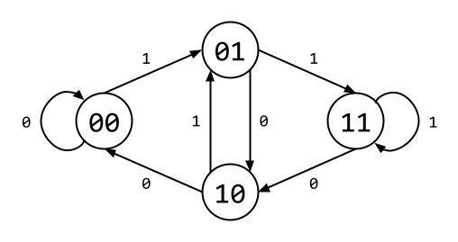
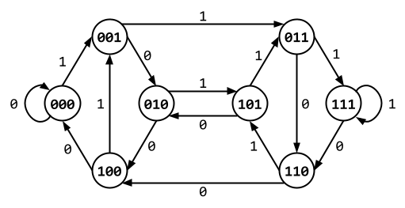
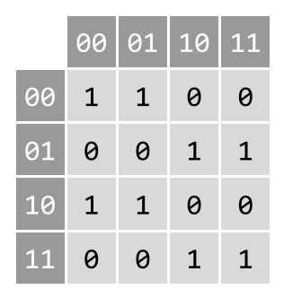
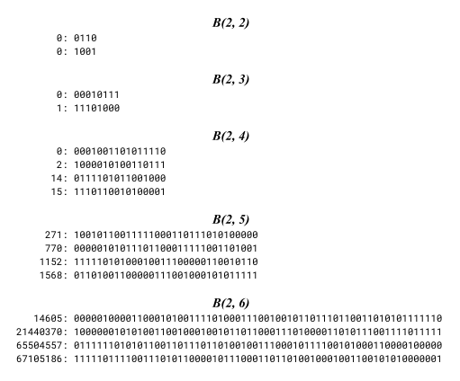

De Bruijn sequences are named after Nicolaas Govert de Bruijn, a Dutch mathematician who wrote about them in his 1946 paper *A Combinatorial Problem*[^1]. The idea, however, dates back to at least the 19th century.

We will begin by exploring some of the interesting combinatorial and graph theoretical properties of de Bruijn sequences. With these in mind, we'll discuss an algorithm which generates all de Bruijn sequences for a given alphabet and window size (these parameters will make sense shortly). Then we'll look at shuffling-related properties, and a few of the applications for these sequences.

## Properties

### Definition and Notation

Let $A$ be an alphabet of $k$ distinct characters[^2]. A **de Bruijn sequence** is a cyclic string of characters from $A$ where each permutation of $n$ characters appears exactly once. $B(k, n)$ will be used to denote the set of de Bruijn sequences of window length $n$ and alphabet length $k$.

### Basic Properties

**Property 1:** The length of a $B(k, n)$ sequence is $k^n$.

**Proof:** The number of n-permutations of k characters is $k^n$, and given by the definition, each of those permutations must appear exactly once. Take $s$ to be a minimum-length sequence of length $l$ consisting of all unique permutations in question. In each window length n sits one permutation. If the window is shifted over one character, this must give another unique permutation. Thus the smallest possible value of $l$ would be $k^n$. Suppose $l > k^n$. Then the number of windows in $s$ would be greater than $k^n$, and thus $s$ would contain non-unique permutations, and would not be a de Bruijn sequence. Therefore, the length of a $B(k, n)$ sequence is $k^n$.

**Property 2:** The number of distinct $B(k, n)$ sequences equals $\frac{(k!)^{k^{n-1}}}{k^n}$. (Because de Bruijn sequences are cyclic, we consider mere rotations of one sequence to be the same, non-distinct, sequence.) For example, B(2,3)[^3] has 2 distinct sequences, 8 characters in length: $00010111$, and $11101000$.

### De Bruijn Graphs

Each $B(k, n)$ has a corresponding de Bruijn graph. The example in the figure below shows the graph for $B(2, 3)$.

**De Bruijn graphs** are directed Eulerian graphs, which is to say that there exists a circuit within the graph which visits each edge exactly once. These graphs have a number of interrelated properties.

**Property 3:** For all vertices of $B(k, n)$, the in-degree equals the out-degree which is equal to the size of the alphabet ($k$). This implies that for all $k$, each vertex has an even degree, which is consistent with the fact that a connected graph has an Eulerian circuit if and only if each vertex has an even degree.

**Property 4:** Each vertex represents a unique permutation of $n-1$ characters from $A$. From this, it follows that $B(k, n)$ is of order $k^{n-1}$.

**Property 5:** Each outgoing edge from each vertex is labeled with a different character $\alpha\in A$. Then any two of the following can be used to determine the label of the third: 2 adjacent vertices and their single adjoining edge. For example: the label of the vertex a particular edge points to can be determined by removing the leftmost character from the outgoing vertex, and appending to it the edge’s label $\alpha$. This is equivalent to shifting the window of a de Bruijn sequence right one character, and that new character being $\alpha$.

**Property 6:** Because each vertex has exactly $k$ incoming and outgoing edges, the number of edges of $B(k, n)$ are $k\cdot k^{n-1}$, or $k^n$. Notice that $B(k, n+1)$ has a number of vertices equal to the number of edges of $B(k, n)$. We can draw the graph for $B(k, n+1)$ in the following way: put a vertex where each edge of $B(k, n)$ would be, whose label is the character on that edge, concatenated to the source vertex. In this way, each vertex remains unique with respect to all other vertices in the $B(k, n+1)$ graph. Applying this method to the $B(2, 3)$ graph pictured above yields the $B(2, 4)$ graph pictured in the figure below.

**Property 7:** By following an Eulerian circuit through a $B(k, n-1)$ graph, and recording the label of each edge as it is visited, one gets a $B(k, n)$ sequence. Furthermore, the set of sequences constructed by taking all Eulerian circuits in the $B(k,n-1)$ graph is identical to the set of $B(k, n)$ sequences. This fact is key in creating a generating algorithm.

**Property 8:**  An Eulerian traversal of a de Bruijn graph is a circuit.

**Proof:** The in-degree of each edge of a de Bruijn graph equals its out-degree (Property 3). Let $v$ be the start vertex of the Eulerian traversal. For $v$ to have been traversed to, on each occasion, it must have first been traversed away from. Thus, once all incoming edges to $v$ have been traversed, the outgoing edges necessarily have also been traversed. Therefore, if it is not the case that an incoming edge to $v$ is the final edge to be traversed (making the traversal a circuit), then the traversal cannot be Eulerian.

## A Generating Algorithm

The following method will generate all de Bruijn sequences of $B(k, n)$ for given values of $k$ and $n$ in two parts: first, generate the corresponding de Bruijn graph; second, traverse through it in all ways which visit each edge exactly once.

### Constructing the Graph

The $B(k, n)$ graph will be represented by an adjacency matrix[^4]. The data structure of choice will be a 2-dimensional array $A_{ij}$, for $0 \leq i,j \leq k^{n-1}$. This choice gives a space complexity of $O(k^{2n-2})$, which is generally unideal for sparse graphs, however we should expect time complexity to be a vastly larger bottleneck for most values of n and k. This choice gives a time complexity for accessing any element of the matrix of O(1).

Each vertex (a value in base-k) corresponds to the index of that value in decimal. Then whether one vertex points to another (or the same) depends on if the rightmost $n-1$ characters of the row index are the same as the leftmost $n-1$ characters of the column index (in the spirit of the example described under Property 5). The adjacency matrix corresponding to the $B(2, 3)$ graph is pictured in the figure below, and can be verified by examining the first figure.

### Traversing the Graph

From properties 7 and 8, we conclude that finding all B(k,n) sequences is equivalent to finding all distinct traversals of the B(k,n) graph which visit each edge once. This will be implemented by recursively traversing through the graph and identifying all traversals which meet that criterion, similar to a depth-first search. Each time a vertex is reached, there are two cases to consider:

1. The vertex has non-traversed outgoing edges: then the edge with the label of lowest numerical value is followed, that edge is noted as visited, and it's label is appended to a list.
2. The vertex has no non-traversed outgoing edges. then, if the list is length $k^n$, an Eulerian circuit has been completed, and the list is a de Bruijn sequence, so it is stored. If the list is less than length $k^n$, that traversal did not complete an Eulerian circuit and the list is not stored. In either case, the rightmost character is truncated from the list, and the vertex in question returns to the previously visited one.

This algorithm terminates when all paths in the graph have been traversed. Implementation involves the use of some additional data structures. A $k^{n-1} \times k^{n-1}$ boolean matrix can be used to keep track of whether an edge has yet been traversed, allowing for $O(1)$ access. Something in the form of a stack data structure ought to be used to store the values of the edges which have been traversed, as this allows for $O(1)$ pushing to and popping from the list.

### Additional Notes

In practice, this algorithm’s biggest bottleneck is neither time nor space complexity (in runtime). The problem is about the volume of data output. These sequences grow in number and length extraordinarily fast (recall Properties 2.1 and 2.2). At 1 byte/character, a file containing all $B(2,6)$ sequences would be 4 GB in size. A file containing all $B(2,7)$ sequences would be 65,000,000,000 GB. Changing the alphabet makes for even more radical growth. A single $B(10,10)$ sequence would be 10 GB.

## Shuffling Binary Sequences

### Shuffling

This section explores special binary de Bruijn sequences which have the property that after undergoing a perfect shuffle, they retain their original order. For brevity, we will say a binary de Bruijn sequence **shuffles** if and only if it has this property. Furthermore, in this section, perfect shuffle[^5] refers to a perfect *in-shuffle* or a perfect *out-shuffle*.

Let $n$ be the length of a sequence, and $i$ denote the index of each element in the sequence, for $0\leq i\leq n-1$.

An **in-shuffle** reorders the elements of the sequence according to the rule:$\\$
$i \to 2i+1, \text{ for } 0 \leq i < \frac{n}{2}$ $\\$
$i \to 2i-n, \text{ for } \frac{n}{2} \leq i < n$

An **out-shuffle** reorders the elements of the sequence according to the rule:$\\$
$i \to 2i, \text{ for } 0 < i < \frac{n}{2}$ $\\$
$i \to 2i-n+1, \text{ for } \frac{n}{2} \leq i < n$

An example of an in-shuffle: $\\$
$\underline{01234}56789 \to 5\underline{0}6\underline{1}7\underline{2}8\underline{3}9\underline{4}$

An example of an out-shuffle: $\\$
$\underline{01234}56789 \to \underline{0}5\underline{1}6\underline{2}7\underline{3}8\underline{4}9$

### Properties

**Property 9:** For a given n, it’s not true that all $B(2, n)$ sequences shuffle.[^6]

**Property 10:** Of sequences that shuffle, only certain rotations do.

Below are some results from a function which checks each rotation of each sequence provided by the generator, and returns those which out-shuffle.

## Applications

De Bruijn sequences have applications in a diverse set of areas. Most notable among them may be gene sequencing in the field of genomics. The basic idea is that codons can be thought of as characters in the alphabet $A$, and a de Bruijn sequence constructed from them provides an efficient, redundancy-free series of coding sequences.[^7]

Another interesting application is in (especially self working[^8]) card magic. For example, one might leverage the binary color options to order the deck in a $B(2, n)$ de Bruijn sequence. The spectator then draws n consecutive cards and recites their colors, on order. With this information and a bit of memorization ahead of time, the performer is able to identify exactly where in the sequence the spectator drew from, and thus what the values of their cards are. A strength of this trick is that one can cut the deck *ad infinitum* without ever breaking the sequence. I think it would be possible to strengthen this type of trick by leveraging properties of certain sequences that shuffle.

As far as other applications, de Bruijn sequences have been used in fMRI research, bit operations in computer science, and even in cracking PIN locks which accept rolling input. There are others, but none appear to be too grand or significant. The diversity of applications is perhaps more notable than the applications themselves.

## Closing Thoughts

De Bruijn sequences and graphs have many interesting and not-too-complicated properties. This fact allowed me to extend my study beyond the existing literature and into a more exploratory domain. In fact, I might have identified several properties unstated in any literature on this subject. As far as I can tell, even the generating algorithm is novel. But of course, there has been very little work done in this area beyond de Bruijn's original paper, and most mathematicians probably had the forethought to know there is no reason why anyone would need *every* sequence in a given alphabet and window.

I wrote a Java implementation of the generating algorithm and shuffles described above, along with a suite of other tools pertaining to de Bruijn sequences and graphs. This code and select output files from the generating function can be found [here](github.com/reednel/DeBruijn).

[^1]: [A combinatorial Problem](https://pure.tue.nl/ws/files/4442708/597473.pdf) (1946), Nicolaas Govert de Bruijn.

[^2]: A binary alphabet is often implied with de Bruijn sequences, but most of what this paper discusses is applicable to an arbitrary alphabet.

[^3]: The nominal values of the characters used in the alphabet are unimportant, so for this paper and generally, when $k < 10$, we take $A = \{ 0, 1, \dots, k \}$.

[^4]: An **adjacency matrix** is a boolean-valued $n$ by $n$ matrix where the indices of the rows and columns correspond to the vertices $1, \dots, n$ in the graph, and the truth-value at a coordinate $(i, j)$ depends on the existence of an edge from vertex $i$ to vertex $j$.

[^5]: Concerning playing cards, a perfect shuffle (in or out) corresponds to a perfect [Faro shuffle](https://en.wikipedia.org/wiki/Faro_shuffle). In practice, it would take much skill to reliably execute the Faro shuffle perfectly.

[^6]: It would be interesting to prove that for all n, there exists a $B(2, n)$ sequence that shuffles.

[^7]: See *A novel codon-based de Bruijn graph algorithm for gene construction from unassembled transcriptomes* (2016). Available [here](https://www.researchgate.net/publication/310461341_A_novel_codon-based_de_Bruijn_graph_algorithm_for_gene_construction_from_unassembled_transcriptomes).

[^8]: A **self working** trick refers to one which follows a fixed procedure that does not depend on circumstance or skill.
